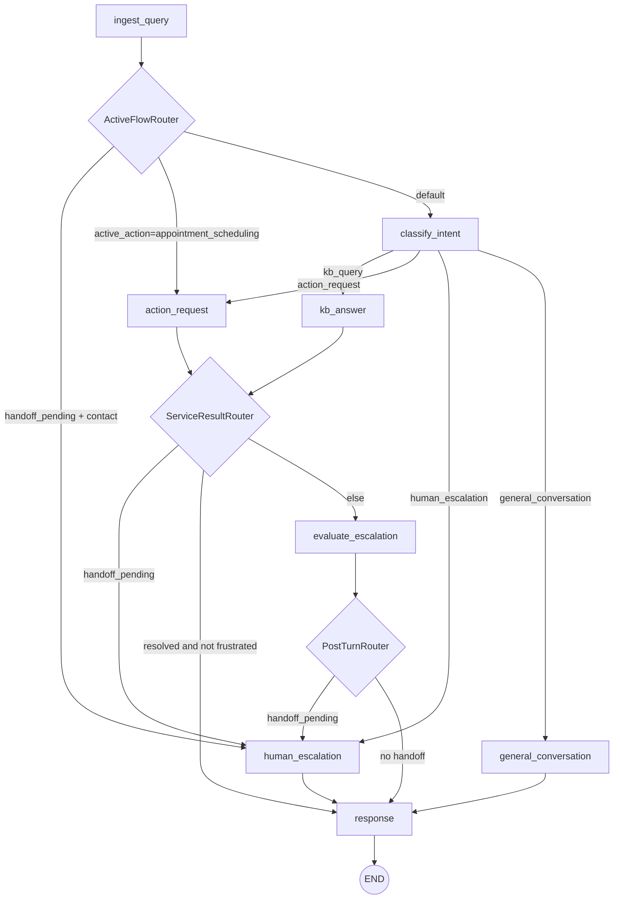

# Customer Care AI Agent - Full Project Documentation

Last updated: 2026-04-11  
Derived from: `README.md`, project markdown notes, and current source code.

## 1. Project Overview

`customer-care-ai-agent` is a LangGraph-based conversational system for customer support use cases.  
It supports four main intents:

- `kb_query`: answer grounded questions from a vectorized knowledge base
- `action_request`: run a multi-turn appointment scheduling flow
- `human_escalation`: hand off to human support and collect contact details
- `general_conversation`: handle greetings/thanks/capability chat naturally

The architecture is intentionally layered:

- graph orchestration in `app/graph`
- reusable conversational agents in `app/agents`
- business logic in `app/services`
- prompt/provider logic in `app/llm`
- ingestion/chunking/vectorization in `processing`
- vector database abstractions + Qdrant implementation in `vector_db`

## 2. Runtime Architecture

### 2.1 Graph Flow

The graph is built in `app/graph/builder.py`.



### 2.2 State Model

`ChatState` lives in `app/graph/state.py`. Key groups:

- routing: `intent`, `confidence`, `active_action`, `handoff_pending`
- escalation: `failure_count`, `turn_outcome`, `turn_failure_reason`, `frustration_flag`, `escalation_reason`, contact fields, `escalation_case_id`
- KB/RAG: `retrieval_query`, `retrieved_context`
- action booking: `appointment_slots`, `missing_slots`, `available_dates`, `available_slots`, `date_confirmed`, `time_confirmed`, `awaiting_confirmation`, booking fields
- response/history: `final_response`, `history`

### 2.3 Router Rules

Routers are in `app/graph/router.py`.

- `ActiveFlowRouter`:
  - keeps active appointment flow in `action_request`
  - if `handoff_pending`, routes to `human_escalation` only when a contact channel exists, otherwise re-runs classification
- `ServiceResultRouter`:
  - resolved service turn with no frustration -> `response`
  - otherwise -> `evaluate_escalation`
- `PostTurnRouter`:
  - if `handoff_pending` -> `human_escalation`
  - else -> `response`

## 3. Layer-by-Layer Components

### 3.1 Configuration and Bootstrapping

Files:

- `app/config/env.py`
- `app/config/yaml.py`

`load_runtime_config()` precedence:

1. existing shell environment variables (protected)
2. `config.yml` (loaded first)
3. `.env` (loaded after and can override YAML, but not protected shell vars)

This precedence is used by CLI/UI/scripts.

### 3.2 Graph Nodes

Nodes are thin adapters in `app/graph/nodes/*`:

- `ingest_query`: normalize query, append user message to history
- `classify_intent`: call classifier and apply state update
- `kb_answer`: call KB agent
- `action_request`: call action agent
- `evaluate_escalation`: call post-turn evaluator
- `human_escalation`: call escalation agent
- `general_conversation`: call general-conversation agent
- `response`: finalize `final_response`, append assistant message to history

### 3.3 Agent Layer

Agent interface (`Protocol`) is defined in `app/agents/contracts.py`.

Concrete agents:

- `KnowledgeBaseAgent`
- `ActionRequestAgent`
- `HumanEscalationAgent`
- `GeneralConversationAgent`

`AgentFactory` (`app/agents/factory.py`) creates agents from service dependencies.

### 3.4 Service Layer

#### Intent

Files:

- `app/services/intent.py`
- `app/services/router.py`
- `app/services/models.py`

`LlmIntentClassifier` calls a provider-backed classifier and falls back safely to:

- intent: `kb_query`
- confidence: `0.0`

`DefaultIntentRouter` promotes escalation on either:

- `handoff_pending`
- `frustration_flag`

#### Conversation History

File: `app/services/history.py`

`DefaultConversationHistoryManager`:

- stores messages as `user: ...` / `assistant: ...`
- can summarize old history into a `summary: ...` line when thresholds are exceeded
- keeps recent messages (default 8)

#### Knowledge Base Answering

File: `app/services/knowledge_base.py`

`RetrievalKnowledgeBaseService` behavior:

- uses raw `user_query` as active retrieval query
- embeds query via configured embedding provider
- searches FAQ and document collections in parallel
- merges and sorts by cosine score only
- default `retrieval_limit=3`
- generates final grounded answer via provider

Failure handling:

- empty query -> `needs_input`
- retrieval failure -> unresolved with `knowledge_base_unavailable`
- no matches -> unresolved with `no_grounded_answer`
- generation failure -> unresolved with `answer_generation_failed`

Notes:

- query rewriting component exists but is not currently active in the retrieval path
- reranker component exists (`app/services/reranking.py`) but is not active in the KB retrieval pipeline

#### Action Request (Appointment Scheduling)

Files:

- `app/services/action_request.py`
- `app/services/action_models.py`
- `app/services/booking_api.py`

Required slot fields:

- `service`, `date`, `time`, `name`, `email`

Flow characteristics:

- multi-turn slot filling with state persistence
- service/date/time validation against offered options
- proactive date lookup once service is known
- time-slot lookup after date confirmation
- LLM-driven confirmation intent (`confirm`/`change`)
- booking only after all required fields are complete and date/time are confirmed

Turn outcomes:

- usually `needs_input` while collecting
- `resolved` on successful booking
- `unresolved` on extractor/booking failures (with escalation reason)

#### Escalation

Files:

- `app/services/escalation.py`
- `app/services/responses.py`
- `app/agents/escalation_agent.py`

`PostTurnEscalationEvaluator`:

- increments `failure_count` on unresolved turns
- resets failure count on resolved/needs_input turns
- triggers handoff when:
  - explicit `escalation_reason` is present
  - unresolved failures reach threshold (default 3)

`HumanEscalationAgent`:

- extracts/validates contact info from state and message text (email/phone regex)
- persists escalation once a contact channel exists
- clears active action state and sets `handoff_pending=True`

`HumanEscalationService`:

- uses LLM-generated handoff reply when available
- falls back to safe template message when provider fails/unavailable

#### General Conversation

File: `app/services/responses.py`

Static rule-based conversational responses for greetings, thanks, capability prompts, and farewells.

### 3.5 LLM Layer

Key files:

- contracts: `app/llm/contracts.py`
- factories: `app/llm/factory.py`, `intent_factory.py`, `action_factory.py`, `escalation_factory.py`, `retrieval_query_factory.py`
- prompts: `app/llm/prompts.py`, `intent_prompts.py`, `action_prompts.py`, `escalation_prompts.py`, `retrieval_query_prompts.py`
- providers:
  - `app/llm/providers/openai.py`
  - `app/llm/providers/gemini.py`
  - `app/llm/providers/azure_openai.py`

Provider coverage:

- KB answer generation
- action reply generation
- escalation reply generation
- intent classification
- retrieval query generation
- appointment extraction (OpenAI/Gemini in `action_extraction.py`, Azure in provider file)

Common traits:

- HTTP calls through `app/llm/http.py`
- strict parsing/validation of generated JSON for intent/extraction paths
- env-configurable system prompts and model names

## 4. Mock Integrations and Data Stores

### 4.1 Mock Booking API

File: `app/mock_api/booking_api.py`

In-process HTTP server starts automatically via `ensure_mock_booking_api_server_started()`.

Endpoints:

- `GET /available-dates`
- `GET /availability`
- `POST /bookings`
- `GET /bookings/{confirmation_id}`
- `DELETE /bookings/{confirmation_id}`

Persistence:

- store path: `data/booking_store.json`
- slot state values: `free` / `booked`
- default seeded calendar:
  - start date: `2026-04-15`
  - window: 31 days
  - slots: every 30 minutes from `09:00 AM` to `05:00 PM`

### 4.2 Escalation Store

File: `app/mock_api/escalation_api.py`

Persistence:

- store path: `data/escalation_store.json`
- record fields include `escalation_id`, contact fields, reason, status, `created_at_utc`

## 5. Retrieval Data and Pipelines

### 5.1 Retrieval Datasets

Current dataset paths used in repo workflows:

- local data corpus:
  - documents manifest: `data/documents/documents_manifest.json` (11 docs)
  - faqs jsonl: `data/faqs/high_quality_faqs.jsonl` (10 FAQ rows)
- interview demo corpus:
  - docs: `cob_mock_kb_large/interview_demo_kb/retrieval/documents/documents_manifest.json` (8 docs)
  - faqs: `cob_mock_kb_large/interview_demo_kb/retrieval/faqs/faqs.jsonl` (48 FAQ rows)

### 5.2 Ingestion

Files:

- `processing/ingestion_pipeline/faqs.py`
- `processing/ingestion_pipeline/documents.py`

Pipelines:

- `FaqJsonlIngestionPipeline`
- `DocumentManifestIngestionPipeline`

Both emit typed processed records and feed chunking strategies.

### 5.3 Chunking

Files:

- `processing/chunking/faqs.py`
- `processing/chunking/documents.py`

FAQ chunking:

- one chunk per FAQ record
- appends category/difficulty text

Document chunking:

- splits by markdown `##` sections
- builds section-aware chunks
- embeds semantic metadata in chunk text:
  - document identity
  - service/title/section
  - normalized keywords, tokens, query hints

### 5.4 Vectorization

Files:

- `processing/vectorization/faqs.py`
- `processing/vectorization/documents.py`
- `processing/vectorization/providers/*`

Strategies:

- `FaqVectorizationStrategy`
- `DocumentVectorizationStrategy`

Embedding providers:

- OpenAI (`text-embedding-3-small` by default)
- Gemini (`gemini-embedding-001` by default)
- Local deterministic provider (for pipeline/testing workflows)

## 6. Vector DB Layer (Qdrant)

Contracts and models:

- `vector_db/contracts.py`
- `vector_db/models.py`

Qdrant implementation:

- setup/settings: `vector_db/qdrant/setup.py`
- store/upsert: `vector_db/qdrant/store.py`
- search: `vector_db/qdrant/search.py`
- record reader: `vector_db/record_management/qdrant.py`

Supported modes:

- embedded local storage (`QDRANT_PATH`)
- remote URL/API key mode (`QDRANT_URL`, `QDRANT_API_KEY`)

Important runtime behavior:

- if local embedded storage is locked by another process, search path can mirror local storage into a temp snapshot and continue in read-only mode (lock-resilience logic in `vector_db/qdrant/search.py`)

## 7. Configuration Reference

### 7.1 Main Provider Selection Keys

- `KB_ANSWER_PROVIDER`
- `INTENT_CLASSIFIER_PROVIDER`
- `ACTION_AGENT_PROVIDER`
- `ACTION_EXTRACTION_PROVIDER`
- `ESCALATION_AGENT_PROVIDER`
- `RETRIEVAL_QUERY_PROVIDER`
- `EMBEDDING_PROVIDER`

### 7.2 Provider Credentials / Models

- Gemini: `GEMINI_API_KEY`, `GEMINI_CHAT_MODEL`, `GEMINI_EMBEDDING_MODEL`, `GEMINI_RETRIEVAL_QUERY_MODEL`
- OpenAI: `OPENAI_API_KEY`, `OPENAI_CHAT_MODEL`, `OPENAI_EMBEDDING_MODEL`
- Azure OpenAI: `AZURE_OPENAI_API_KEY`, `AZURE_OPENAI_ENDPOINT`, `AZURE_OPENAI_CHAT_DEPLOYMENT`, `AZURE_OPENAI_API_VERSION`

### 7.3 Vector DB Keys

- `QDRANT_COLLECTION`
- `QDRANT_DOCUMENT_COLLECTION`
- `QDRANT_EMBEDDING_DIMENSION`
- `QDRANT_DISTANCE`
- `QDRANT_PATH`
- `QDRANT_URL`
- `QDRANT_API_KEY`
- `QDRANT_PREFER_GRPC`

### 7.4 Pipeline Keys

- `FAQS_JSONL_PATH`
- `DOCUMENTS_MANIFEST_PATH`
- `DOCUMENTS_ROOT_PATH`
- `FAQ_PIPELINE_LIMIT`
- `FAQ_PIPELINE_BATCH_SIZE`
- `DOCUMENT_PIPELINE_LIMIT`
- `DOCUMENT_PIPELINE_BATCH_SIZE`

### 7.5 Optional Reranker Keys

- `RERANKER_ENABLED`
- `RERANKER_PROVIDER`
- `RERANKER_MODEL`
- `COHERE_API_KEY`
- `COHERE_RERANK_URL`

## 8. Scripts and Operational Commands

### 8.1 Setup

```bash
python3 -m venv .venv
source .venv/bin/activate
pip install --upgrade pip
pip install -e .
cp .env.example .env
cp config.yml.example config.yml
```

### 8.2 Qdrant Collection Setup

```bash
.venv/bin/python scripts/setup_qdrant.py
```

### 8.3 Build Interview Demo Dataset

```bash
.venv/bin/python scripts/build_interview_demo_dataset.py
```

### 8.4 Ingestion Pipelines

FAQ:

```bash
.venv/bin/python scripts/run_faq_processing_pipeline.py
```

Documents:

```bash
.venv/bin/python scripts/run_document_processing_pipeline.py
```

### 8.5 Run Applications

CLI:

```bash
.venv/bin/python scripts/run_cli_chat.py
```

Streamlit UI:

```bash
.venv/bin/python -m streamlit run ui/streamlit_app.py
```

### 8.6 Utilities

Graph image:

```bash
.venv/bin/python scripts/export_graph_png.py
```

Retrieval check:

```bash
.venv/bin/python scripts/test_faq_retrieval.py
```

Vector record inspection:

```bash
.venv/bin/python scripts/inspect_qdrant_vectors.py
```

## 9. UI Behavior

Main UI file: `ui/streamlit_app.py`

Capabilities:

- chat UI over the same backend graph
- optimistic previews for simple conversational turns
- node-by-node progress while graph streams updates
- latency caption (`backend` vs `ui_total`)
- optional debug panels:
  - vector query
  - routing/node trace logs
  - retrieved chunks

## 10. Testing Status

Test framework: `unittest` (run via `pytest` or module discovery).  
Current test methods discovered: 95.

Coverage areas include:

- action booking flow and validation (`tests/test_action_request_service.py`)
- escalation API + contact persistence/validation (`tests/test_escalation_api.py`, `tests/test_escalation_contact.py`, `tests/test_escalation_response_generation.py`, `tests/test_escalation_flow.py`)
- graph routing rules (`tests/test_graph_router.py`)
- config loading precedence (`tests/test_config_loader.py`)
- KB retrieval behavior and error handling (`tests/test_knowledge_base_service.py`)
- prompt guardrails (`tests/test_kb_prompts.py`, `tests/test_intent_prompts.py`)
- intent classifier fallback behavior (`tests/test_intent_service.py`)
- query rewriting component behavior (`tests/test_query_rewriting.py`)
- document ingestion/chunking/vectorization (`tests/test_document_processing.py`)
- Azure provider URL/header/parsing behavior (`tests/test_llm_azure_provider.py`)
- core dataclass state updates (`tests/test_service_models.py`)

## 11. Design Decisions Captured Across Project Docs

From project notes, the following decisions are consistent with current code:

- thin graph nodes, service-heavy business logic
- agent abstraction layer between graph and services
- protocol-based contracts for many interfaces
- standalone `vector_db` and `processing` packages (infrastructure separated from app services)
- cosine-first retrieval baseline
- semantic metadata embedding to improve retrieval quality
- human escalation as a first-class mid-conversation flow

## 12. Known Constraints and Current Gaps

- query rewriting exists but is not currently active in the KB retrieval path
- reranker implementation exists but is not currently applied in KB retrieval
- appointment workflow focuses on booking/create flow; rescheduling/reassignment workflows are not yet implemented
- mock APIs and local JSON stores are demo-friendly, not production-grade service infrastructure
- reliability, retries, and circuit-breaking are basic and can be expanded for production hardening

## 13. Existing Documentation Index

Primary docs:

- `README.md` - main usage and architecture overview
- `KB_AGENT_WALKTHROUGH.md` - KB flow walkthrough
- `ACTION_AGENT_WALKTHROUGH.md` - appointment action flow details
- `DOCUMENT_RAG_IMPLEMENTATION.md` - document-RAG implementation notes
- `RETRIEVAL_QUERY_REWRITING.md` - rewriter component status
- `UI_DEBUG_GUIDE.md` - debug-focused Streamlit usage
- `LATENCY_WORKPLAN.md`, `LATENCY_TIPS.md` - latency notes and plan
- `INTERFACE_DECISIONS.md`, `AGENT_INTERFACE_DECISION.md` - contract/interface rationale
- `OOP_SOLID_PRINCIPLES.md` - architecture principles
- `CHANGELOG.md` - recent changes
- `vector_db/ARCHITECTURE.md`, `vector_db/qdrant/README.md`, `vector_db/qdrant/SETUP_SPECS.md` - vector DB architecture/setup
- `data/VECTOR_DB_REFRESH_PROCESS.md` - vector refresh runbook
- `data/Data Migration.md` - local data migration notes

---

This file is intended as a consolidated, code-aligned reference for onboarding and development.  
For implementation-level details, read this alongside the source files listed per section.
